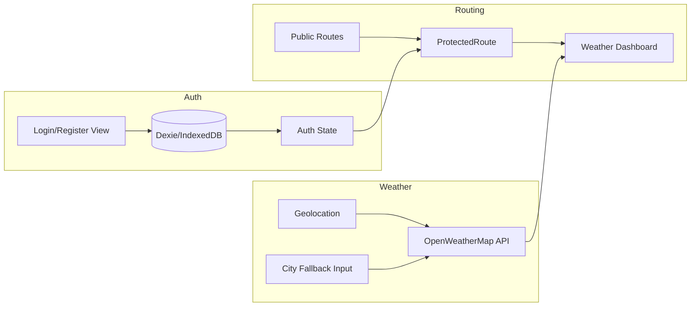

# Plan: React Auth + Weather Dashboard

El proyecto ya tiene **Vite + React 19 + TypeScript** ([package.json](package.json)). Este plan añade Tailwind, Shadcn, React Router DOM y Dexie, y construye un flujo de login/registro con persistencia en IndexedDB y un dashboard de clima protegido que usa geolocalización y OpenWeatherMap.

---

## 1. Dependencias e instalación

**Añadir al proyecto:**

- **Tailwind CSS v4** (o v3): `tailwindcss`, `postcss`, `autoprefixer` — configurar según docs oficiales (content en `index.html` y `src/**/*.{ts,tsx}`).
- **Shadcn/ui**: Inicializar con `pnpm dlx shadcn@latest init` (o `npx` si usas npm). Elegir estilo por defecto, base color neutral, CSS variables sí, `src/components/ui`, alias `@/*` → `./src/*`. Añadir componentes: `Button`, `Input`, `Card`, `Label` (y los que pida el formulario de login/registro).
- **React Router DOM**: `react-router-dom` (v7 recomendado con el stack actual).
- **Dexie.js**: `dexie` — wrapper de IndexedDB para guardar usuarios.

**Nota:** Las reglas del proyecto en [.cursor/rules/frontend.mdc](.cursor/rules/frontend.mdc) indican **PNPM**; si el equipo usa npm, sustituir `pnpm` por `npm` en los comandos.

**Variable de entorno:** Vite solo expone variables con prefijo `VITE_` al cliente. En [.env](.env) ya existe `OPEN_WEATHER_API_KEY`. Añadir (o renombrar) a `VITE_OPEN_WEATHER_API_KEY` y usarla en el código como `import.meta.env.VITE_OPEN_WEATHER_API_KEY`. Documentar en README que no se suba `.env` con la key.

---

## 2. Estructura de carpetas (alineada con frontend.mdc)

```
src/
  common/           # compartido
    db/              # Dexie: definición DB y tablas (users)
    lib/             # utils, cn(), etc.
    types/           # User, Weather, etc.
    hooks/           # useAuth, useGeolocation (opcional)
    layouts/         # layout público vs layout con nav
  features/
    auth/            # login/registro: componentes, lógica, integración con Dexie
    weather/         # lógica clima: geolocation, fetch OpenWeatherMap, búsqueda por ciudad
  views/             # páginas
    Login.tsx
    Register.tsx
    WeatherDashboard.tsx
  routes/            # definición de rutas y ProtectedRoute
  components/ui/     # Shadcn (generados por CLI)
  App.tsx
  main.tsx
  index.css          # Tailwind directives + variables Shadcn
```

---

## 3. Base de datos (Dexie) y auth

- **Dexie:** Crear base (ej. `AppDB`) con una tabla `users`:
  - Campos: `id` (autoincrement o uuid), `email` (unique), `passwordHash` (guardar hash simple en cliente, ej. con `crypto.subtle` o texto plano solo para demo; si es demo, se puede dejar en claro y documentarlo).
  - Índice único en `email` para evitar duplicados en registro.
- **Auth “en memoria”/estado:** Mantener en estado (Context o Zustand) si el usuario está logueado y sus datos mínimos (id, email). Al iniciar la app, opcionalmente intentar “restaurar” sesión desde IndexedDB (por ejemplo leyendo un usuario por email guardado en `localStorage`/`sessionStorage`).
- **Login:** Formulario (email + contraseña). Buscar en Dexie por `email`; si existe y la contraseña coincide, guardar sesión y redirigir al dashboard.
- **Registro:** Formulario (email + contraseña + confirmación). Comprobar que no exista ya el email en Dexie; añadir usuario y redirigir a login o directamente al dashboard con sesión iniciada.

Rutas públicas: `/login`, `/register`. Ruta protegida: `/dashboard` (o `/` como dashboard y `/login`, `/register` como públicas).

---

## 4. Rutas y ruta protegida

- **React Router DOM:** En `App.tsx` (o en `src/routes/index.tsx`) definir:
  - `BrowserRouter`, rutas con `createBrowserRouter` + `RouterProvider` o `<Routes>`.
  - Rutas: `/login`, `/register`, `/dashboard`.
- **Protected route:** Componente (ej. `ProtectedRoute`) que compruebe si hay usuario logueado; si no, redirigir a `/login`. Aplicar a la ruta del dashboard.
- **Redirección post-login:** Tras login/registro exitoso, `navigate('/dashboard')`.

---

## 5. Dashboard de clima (ruta protegida)

- **Al montar el dashboard:**
  1. Pedir **geolocalización** con `navigator.geolocation.getCurrentPosition`.
  2. Si se obtiene posición: llamar a OpenWeatherMap **Current weather by coordinates**:
    - `https://api.openweathermap.org/data/2.5/weather?lat={lat}&lon={lon}&appid={key}&units=metric`
  3. Si el usuario **deniega** o **falla** (timeout/error): no mostrar error crítico; mostrar un **fallback**: input de Shadcn para que escriba el nombre de la ciudad.
  4. **Búsqueda por ciudad:** Usar **Geocoding API** de OpenWeatherMap para convertir ciudad a lat/lon, luego llamar al mismo endpoint de current weather con esas coordenadas (o usar endpoint por ciudad si se prefiere y está disponible).
- **UI:** Mostrar en cards de Shadcn: ciudad, temperatura, descripción, icono (OpenWeatherMap devuelve `weather[0].icon`), humedad, viento, etc. Estados de carga (skeleton) y error amigable.
- **Variable de entorno:** Leer `import.meta.env.VITE_OPEN_WEATHER_API_KEY`; si no está definida, mostrar mensaje claro en desarrollo.

---

## 6. Flujo de datos (resumen)




---

## 7. Archivos clave a crear/modificar


| Acción     | Archivo / paso                                                                                                          |
| ---------- | ----------------------------------------------------------------------------------------------------------------------- |
| Config     | `tailwind.config.js` (o postcss + tailwind en `index.css` si v4), `components.json` (Shadcn), `tsconfig` path `@/*`     |
| DB         | `src/common/db/index.ts` — Dexie database + tabla `users`                                                               |
| Types      | `src/common/types/user.ts`, `src/common/types/weather.ts` (tipos para API OpenWeatherMap)                               |
| Auth       | `src/features/auth/` — formularios Login/Register, uso de Dexie y estado de sesión                                      |
| Auth state | Context o Zustand en `src/common/` para usuario actual                                                                  |
| Routes     | `src/routes/` — definición de rutas + `ProtectedRoute`                                                                  |
| Views      | `src/views/Login.tsx`, `Register.tsx`, `WeatherDashboard.tsx`                                                           |
| Weather    | `src/features/weather/` — hook o función para geolocation + fetch por coords y por ciudad (Geocoding + current weather) |
| App        | `src/App.tsx` — Router y rutas; `src/main.tsx` — envolver con providers si aplica                                       |
| Env        | `.env` con `VITE_OPEN_WEATHER_API_KEY` (y opcionalmente `.env.example` sin valor)                                       |


---

## 8. Comprobación final

- `pnpm install` (o `npm install`) sin errores.
- `pnpm dev` (o `npm run dev`) levanta la app.
- Flujo: registro → login → acceso a `/dashboard`; sin login, redirige a `/login`.
- Dashboard: con permisos de ubicación muestra clima por coords; si se deniega, el input de ciudad permite buscar y ver clima.
- Sin key en `.env`: mensaje claro en UI o en consola para no fallar en silencio.

---

## 9. Ubicación del plan

Este plan se guarda en `**.cursor/plans**` como referencia. La implementación se realiza en la raíz del repo (`src/`, `package.json`, configuración de Tailwind/Shadcn, etc.).